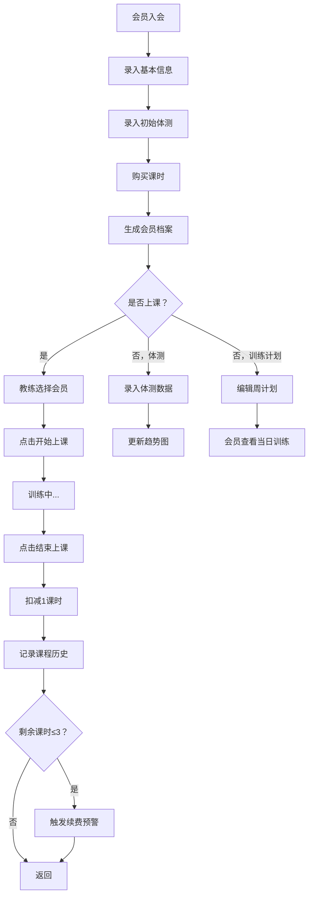

## 1. 产品概述

面向小型健身房（私教工作室）的会员体测与课程消耗一体化管理工具，解决会员信息管理混乱、课时消耗统计不清、训练计划不规范、续费跟进不及时等核心痛点。通过数字化管理提升私教工作室运营效率，增强会员留存与续费率。

---

## 2. 核心功能

### 2.1 用户角色
| 角色 | 登录方式 | 核心权限 |
|------|----------|----------|
| 教练/管理员 | 账号密码登录 | 管理会员、录入体测、开始/结束课程、制定训练计划、查看统计报表 |
| 会员 | 会员码/手机号登录 | 查看当日训练计划、查看体测趋势、查看剩余课时 |

### 2.2 功能模块
1. **仪表盘首页**：今日课程概览、课时预警、流失预警会员、核心数据统计卡片
2. **会员管理**：会员列表、新增会员、会员详情（基本信息+体测记录）
3. **体测管理**：录入体测数据（体重、体脂率、围度）、体测历史、趋势图
4. **课程管理**：开始上课/结束上课、课时消耗自动记录、课程历史
5. **训练计划**：按周循环制定计划（动作、组数、重量）、会员端当日训练查看
6. **统计报表**：教练课时统计、会员续费率、流失预警列表

### 2.3 页面详情
| 页面名称 | 模块名称 | 功能描述 |
|----------|----------|----------|
| 仪表盘 | 数据概览卡片 | 会员总数、今日课程、本月课时、续费预警数 |
| 仪表盘 | 今日课程列表 | 显示当日课程安排，支持一键开始/结束 |
| 仪表盘 | 预警提醒区 | 剩余课时≤3节会员、连续30天未打卡会员 |
| 会员列表 | 会员搜索筛选 | 按姓名、手机号、教练筛选会员 |
| 会员列表 | 会员卡片/表格 | 展示会员头像、基本信息、剩余课时、上次训练时间 |
| 会员详情 | 基本信息卡片 | 姓名、电话、入会时间、所属教练、总课时/剩余课时 |
| 会员详情 | 体测记录列表 | 按时间倒序展示历史体测数据，支持新增体测 |
| 会员详情 | 体测趋势图 | 体重变化曲线、体脂率变化曲线，支持时间范围筛选 |
| 会员详情 | 课程历史 | 历史上课记录（日期、时长、消耗课时） |
| 会员详情 | 训练计划 | 按周几编排的训练动作、组数、重量 |
| 体测录入 | 体测表单 | 体重、体脂率、BMI、胸围、腰围、臀围、大腿围、手臂围、备注 |
| 课程面板 | 会员选择 | 下拉/搜索选择上课会员 |
| 课程面板 | 开始上课 | 记录开始时间、计时中状态 |
| 课程面板 | 结束上课 | 记录结束时间、自动扣减1课时、记录教练 |
| 训练计划编辑 | 周循环编排 | 周一至周日，每天可添加多个训练动作 |
| 训练计划编辑 | 动作项 | 动作名称、组数x次数、重量、休息时间、备注 |
| 统计报表 | 教练课时排行 | 统计周期内各教练总课时数、柱状图展示 |
| 统计报表 | 续费率统计 | 续费会员数/到期会员数，展示趋势 |
| 统计报表 | 流失预警列表 | 连续30天未打卡会员列表，支持一键标记跟进 |

---

## 3. 核心流程

### 3.1 会员入会流程
教练录入会员基本信息 → 录入初始体测数据 → 购买总课时数 → 生成会员档案 → 关联所属教练

### 3.2 上课流程
教练选择会员 → 点击"开始上课"（系统记录开始时间、开始计时）→ 训练完成 → 点击"结束上课" → 系统自动扣减1课时 → 记录课程历史 → 若剩余课时≤3节触发续费预警

### 3.3 体测与训练流程
教练/管理员录入体测数据 → 系统更新趋势曲线 → 教练制定/更新周训练计划 → 会员登录查看当日训练内容

---

## 4. 用户界面设计

### 4.1 设计风格
- **主色调**：深邃墨绿 `#0F3D33`（专业、活力、健康），搭配活力橙 `#FF7A3D`（行动、警示、能量）
- **辅助色**：石板灰作为中性基底，翡翠绿作为成功态，琥珀色作为提醒态，珊瑚红作为警示态
- **按钮风格**：圆角中等（rounded-lg），主按钮实心填色+微光悬浮，次按钮描边+背景微变
- **字体**：标题使用 "Space Grotesk"（几何现代感），正文使用 "Inter"（清晰易读）
- **布局风格**：左侧导航栏 + 顶部面包屑 + 主内容卡片化布局，大量留白与分区清晰
- **图标风格**：Lucide 线性图标，统一 stroke-width=2，尺寸 18-20px
- **特殊效果**：卡片 subtle 阴影 + hover 提升；数据趋势图渐变填充；预警徽章脉冲动画

### 4.2 页面设计概览
| 页面名称 | 模块名称 | UI元素与风格 |
|----------|----------|--------------|
| 仪表盘 | 数据概览 | 4张渐变数据卡（墨绿→深青），大号数字+趋势箭头，微噪点底纹 |
| 仪表盘 | 预警区 | 橙色警示横幅（剩余课时），红色流失卡片，脉冲红点标记 |
| 仪表盘 | 今日课程 | 时间轴布局，每条课程卡片含会员头像+状态标签（待开始/进行中/已完成） |
| 会员列表 | 搜索栏 | 左侧搜索框+筛选芯片，右侧"新增会员"主按钮 |
| 会员列表 | 会员表格 | 斑马行悬停高亮，状态标签（活跃/休眠/预警），操作列铅笔与删除 |
| 会员详情 | 头部 | 圆形头像+姓名标签+快速指标卡（剩余课时、体脂率变化、BMI） |
| 会员详情 | 体测趋势 | 双折线图（体重+体脂率），渐变区域填充，时间切换（1月/3月/全部） |
| 会员详情 | 训练计划 | 周几Tab切换，每日动作列表含编号+动作名+组次Chip |
| 课程面板 | 开始上课 | 大尺寸CTA按钮，绿色脉冲边框进行中状态，计时器大字展示 |
| 统计报表 | 柱状图 | 教练课时对比，渐变柱子，hover显示详情，顶部排序切换 |

### 4.3 响应式
- **设计原则**：Desktop-first（默认1440px栅格），断点适配 1024px / 768px / 375px
- **大屏（≥1280px）**：左侧导航固定 240px，主内容 12 栅格
- **平板（768-1279px）**：左侧导航折叠为图标导航（64px），图表区堆叠
- **手机（<768px）**：底部Tab导航，卡片全宽，图表简化单轴展示，表格转卡片列表

### 4.4 动效与交互
- 页面进入：内容区从下向上 24px 渐入，stagger 50ms
- 卡片悬浮：translateY(-2px) + shadow-md 加深，150ms ease-out
- 开始上课按钮：点击后边框出现绿色脉冲圈，计时器数字滚动
- 预警徽章：红色呼吸灯动画（opacity 0.4→1 循环）
- 切换Tab：下划线从原位置滑动到新位置 200ms
