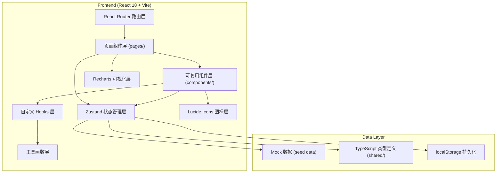
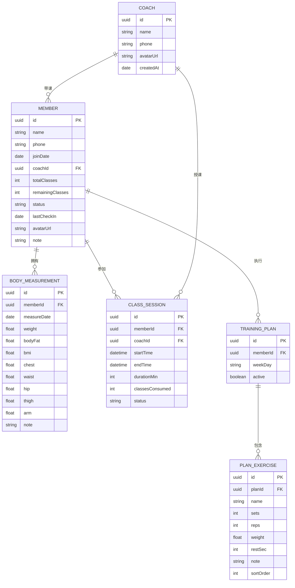

## 1. 架构设计



---

## 2. 技术选型说明

- **前端框架**：React 18 + TypeScript — 类型安全、组件化开发、生态成熟
- **构建工具**：Vite 5 — 极速 HMR、原生 ESM、开箱即用 TS 支持
- **样式方案**：Tailwind CSS 3 + CSS Variables — 原子化 CSS、快速原型、统一设计 token
- **状态管理**：Zustand — 轻量极简、无需 Provider、TS 友好、持久化中间件
- **路由方案**：React Router Dom 6 — 嵌套路由、数据路由器、Loader/Action
- **可视化图表**：Recharts — React 原生、声明式 API、折线/柱状图开箱即用
- **图标库**：lucide-react — 线性风格一致、Tree-shaking 友好
- **数据持久化**：localStorage + zustand persist 中间件 — 无需后端即可 Demo，刷新不丢数据
- **后端**：无后端，纯前端 Mock 模式（用户可后续接入 Express）

---

## 3. 路由定义

| 路由路径 | 页面名称 | 主要功能 |
|----------|----------|----------|
| `/` | 仪表盘 Dashboard | 数据概览、今日课程、预警提醒 |
| `/members` | 会员列表 MemberList | 搜索筛选、新增会员入口、会员概览 |
| `/members/:id` | 会员详情 MemberDetail | 基本信息、体测记录、趋势图、课程历史、训练计划 |
| `/members/new` | 新增会员 MemberNew | 录入会员基本信息与初始体测 |
| `/classes` | 课程管理 ClassPanel | 选择会员、开始/结束上课、计时 |
| `/plans` | 训练计划 PlanEditor | 按会员查看/编辑周训练计划 |
| `/reports` | 统计报表 Reports | 教练课时、续费率、流失预警列表 |
| `/member-view` | 会员端 MemberPortal | 会员登录查看当日训练、体测趋势、剩余课时 |

---

## 4. 数据模型

### 4.1 ER 图



### 4.2 核心业务规则

1. **课时扣减规则**：每次点击"结束上课"扣减 1 课时，`remainingClasses = remainingClasses - 1`
2. **续费预警规则**：当 `remainingClasses ≤ 3` 且 `remainingClasses > 0` 时标记为"课时预警"
3. **流失预警规则**：`lastCheckIn` 距离当前日期 ≥ 30 天 且 `status = 'active'` 时标记"流失预警"
4. **续费率公式**：统计周期内续费会员数 ÷ 同期课时耗尽会员数 × 100%
5. **BMI 计算**：`BMI = weight(kg) ÷ (height(m))²`（身高存储在 MEMBER 中）

---

## 5. 项目目录结构

```
d:\code\TraeProjects\1656
├── public/
│   └── favicon.svg
├── src/
│   ├── main.tsx
│   ├── App.tsx
│   ├── index.css
│   ├── shared/
│   │   └── types.ts              # 全局类型定义
│   ├── store/
│   │   ├── useMemberStore.ts    # 会员与体测状态
│   │   ├── useClassStore.ts     # 课程状态
│   │   ├── useCoachStore.ts     # 教练状态
│   │   └── usePlanStore.ts      # 训练计划状态
│   ├── data/
│   │   └── seedData.ts          # Mock 初始数据
│   ├── utils/
│   │   ├── date.ts              # 日期工具
│   │   ├── calculations.ts      # BMI、续费率计算
│   │   └── formatters.ts        # 数字/单位格式化
│   ├── hooks/
│   │   ├── useTimer.ts          # 上课计时 Hook
│   │   └── useChartData.ts      # 图表数据转换
│   ├── components/
│   │   ├── layout/
│   │   │   ├── Sidebar.tsx
│   │   │   ├── Header.tsx
│   │   │   └── MemberPortalLayout.tsx
│   │   ├── ui/
│   │   │   ├── DataCard.tsx
│   │   │   ├── MemberTable.tsx
│   │   │   ├── BodyChart.tsx
│   │   │   ├── ClassTimer.tsx
│   │   │   ├── PlanDayEditor.tsx
│   │   │   ├── AlertBadge.tsx
│   │   │   └── StatBarChart.tsx
│   │   └── forms/
│   │       ├── MemberForm.tsx
│   │       └── MeasurementForm.tsx
│   └── pages/
│       ├── Dashboard.tsx
│       ├── MemberList.tsx
│       ├── MemberDetail.tsx
│       ├── MemberNew.tsx
│       ├── ClassPanel.tsx
│       ├── PlanEditor.tsx
│       ├── Reports.tsx
│       └── MemberPortal.tsx
├── api/                         # 预留后端目录
├── shared/                      # 前后端共享类型
├── index.html
├── vite.config.ts
├── tsconfig.json
├── tailwind.config.js
├── postcss.config.js
└── package.json
```

---

## 6. 设计 Token（Tailwind 扩展）

```js
// tailwind.config.js 关键扩展
theme: {
  extend: {
    colors: {
      brand: {
        50:  '#ECF5F2',
        100: '#CFE6DF',
        300: '#6FB8A5',
        500: '#0F3D33',   // 主色：深邃墨绿
        600: '#0B2E27',
        700: '#08221D',
      },
      accent: {
        400: '#FF9A6B',
        500: '#FF7A3D',   // 次色：活力橙
        600: '#E8652A',
      },
      success: '#10B981',
      warning: '#F59E0B',
      danger:  '#EF4444',
      ink: {
        900: '#0F172A',
        700: '#334155',
        500: '#64748B',
        300: '#CBD5E1',
        100: '#F1F5F9',
      }
    },
    fontFamily: {
      display: ['"Space Grotesk"', 'system-ui', 'sans-serif'],
      sans:    ['Inter', 'system-ui', 'sans-serif'],
    },
    boxShadow: {
      soft: '0 4px 24px -4px rgba(15, 61, 51, 0.08)',
      card: '0 2px 12px -2px rgba(15, 23, 42, 0.06)',
      lift: '0 12px 32px -8px rgba(15, 61, 51, 0.15)',
    },
    animation: {
      'pulse-slow': 'pulse 2.4s cubic-bezier(0.4, 0, 0.6, 1) infinite',
      'fade-up':    'fadeUp 420ms ease-out both',
    }
  }
}
```
